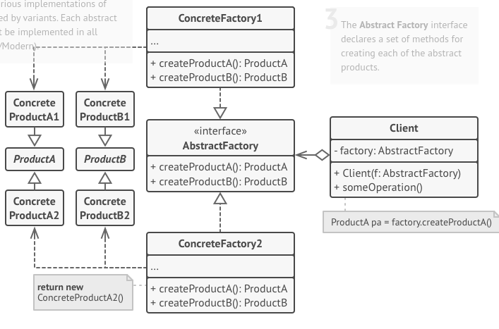

# The Abstract Factory
Typically, this separation into a new class would happen when the concern with object creation starts to be as relevant, if not more, than the main concern of the "client" class. For example, when the factory creates various types of objects.
 
# Structure and Example
For this example I'll extend the [Factory](/Creational/Factory/README.md) example, using the structure below:


- An abstract superclass `GUIFactory` use `Button` and `CheckBox` interfaces.
  - The `WindownsGUIFactory` subclass creates concrete objects: `WindownsButton` and `WindownsCheckbox`
  - The `WebDialog` subclass creates concrete objects: `HTMLButton` and `HTMLCheckbox`
- The Main program only handle `GUIFactory`, `Button` and `CheckBox` interfaces.

# Run the example
To run the example, you need have the jdk to compile the code, consult the [installation instructions](https://docs.oracle.com/javase/8/docs/technotes/guides/install/install_overview.html).  

After that, you need to compile the code:
```
javac Main.java
```
And then, run it:
```
java Main
```