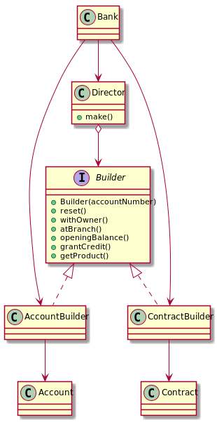

# Builders and Directors
The Builder pattern organizes object construction into a set of steps, optionals or not, to compose a product (object). 
For example, a car can have, or not, a radio. 
Some of the construction steps might require a different implementation to different object configuration. 
For example, a car can have an automatic or manual transmission.  

The Builder itself do not care how you compose your product, you can decide that, or call a *Director*. 
The director class is responsible for dictate which steps to take (so it's a good place to put constructions routines). 
You can build a car with (call buildCar), or without( call buildCarWithRadio), a radio. 
The same builder will create the same product, but following a different steps sequences. 
You can even use the same Director to build different products.
For example, the process of building a car manual can be the same as the corresponding car. 

# Example
I'll implement a bank account, from [dzone article](https://dzone.com/articles/design-patterns-the-builder-pattern).
Then I'll add a Director and a contract to implement the structure from [refactoring.guru](https://refactoring.guru/design-patterns/builder).
The resulting structure:

# Run the example
To run the example, you need have the jdk to compile the code, consult the [installation instructions](https://docs.oracle.com/javase/8/docs/technotes/guides/install/install_overview.html).  

After that, you need to compile the code, enter `src` folder:
```
javac bank/Bank.java
```
And then, run it:
```
java bank.Bank
```
