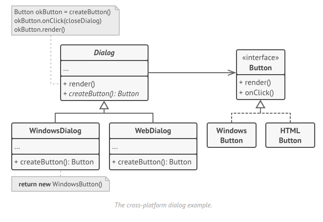

# The Factory Method
 The Factory Method  is a creational design pattern that provides an interface for creating objects but allows subclasses to alter the type of an object that will be created. It separates product construction code, within an method, from the code that actually uses the product, the class main purpose.
 
# Example
For the `Factory` example I'll use the [reffactoring.guru](https://refactoring.guru/design-patterns/factory-method) example:  
> Create a cross-platform UI elements without coupling the client code to concrete UI classes.  



- A superclass `Dialog` handle objects using `Button` interface, and creates `DefaultButton`.
  - The `WindownsDialog` subclass creates a concrete button: `WindownsButton`
  - The `WebDialog` subclass creates a concrete button: `HTMLButton`
- The Main program only handle a `Dialog` and `Button` interfaces.

# Run the example
To run the example, you need have the jdk to compile the code, consult the [installation instructions](https://docs.oracle.com/javase/8/docs/technotes/guides/install/install_overview.html).  

After that, you need to compile the code:
```
javac Main.java
```
And then, run it:
```
java Main
```