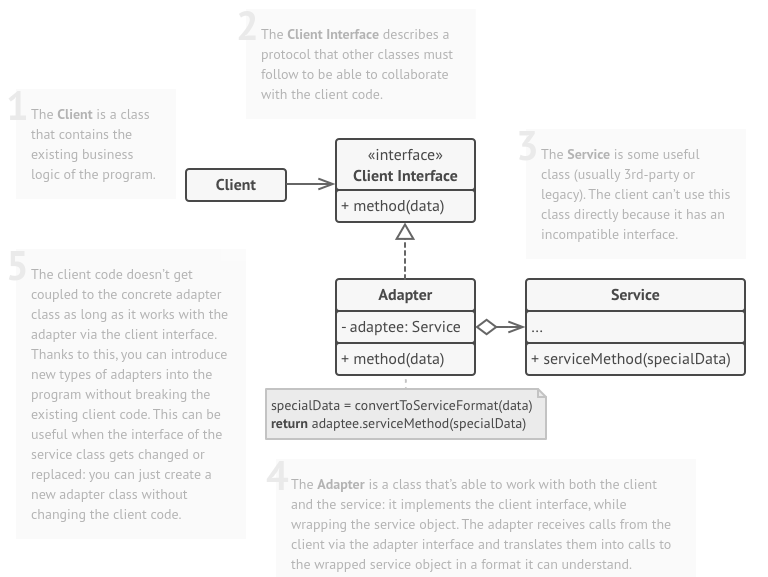
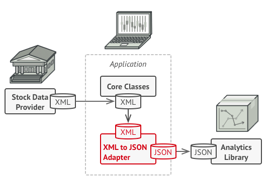

# The pattern

The adapter pattern allow 2 incompatible objects to interact by providing a compatible interface to one, 
and implementing it using the other. For example, you can call a method that receive meters and kilometers, 
convert the data to imperial units, such as feet and miles, and use a object that has an equivalent method.

In the structure below, the Client needs an interface that uses a SI units, the adapter implements that interface and 
converts to imperial units, and call the Service using te imperial units. The Service could returns some value, that 
the adapter would convert to SI units and then return it. 


The structure above represents the object adapter pattern, because is based on the object composition principle.
There is also the class adapter pattern, where the adapter class inherits interfaces from both objects at the same time.
But Java doesn't support it, so, at this point, I'll leave at this.       

# The example
For this exercise I'll use the example that the 
*[Dive into Design Patterns](https://refactoring.guru/design-patterns/book)* book uses describe the problem solved by
 this pattern.
 
>Imagine that you’re creating a stock market monitoring app. 
>The app downloads the stock data from multiple sources in XML format and then displays nice-looking charts and 
>diagrams for the user.
>At some point, you decide to improve the app by integrating a smart 3rd-party analytics library.
>But there’s a catch: the analytics library only works with data in JSON format.

The figure below illustrate the solution using an xml to json adapter. 


# How to run it

To run the example, you need have the jdk to compile the code, consult the 
[installation instructions](https://docs.oracle.com/javase/8/docs/technotes/guides/install/install_overview.html).  

After that, you need to enter the Java folder compile the code:
```
javac Main.java
```
And then, run it:
```
java Main
```