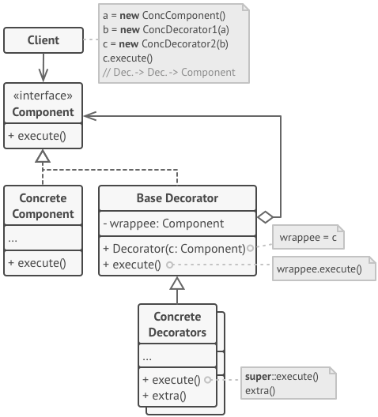
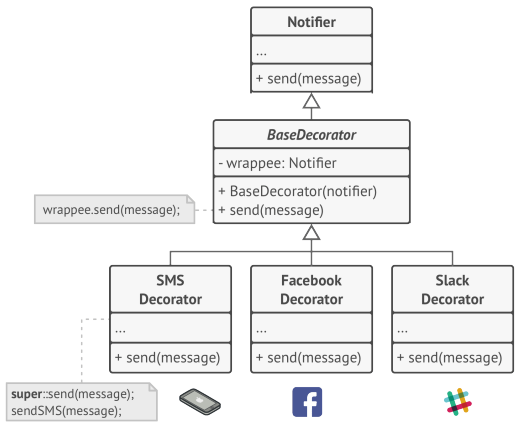

# The pattern

Decorator is a structural design pattern that extends the functionality of an interface by calling that interface, 
through a component with the same interface, and adding more to it. 

Since the decorator implements the same interface of its component, 
a decorator can be the component for another decorator.   
To allow this, a base decorator, composed by a base component which does not call the method again, 
needs to exist, as shown in the image below. 

  
*Font: Dive into Design Patterns*

Is possible to simplify this by creating the base decorator as a subclass of the base component. 
This structure is shown in the example.
  
# The Example

For this exercise I'll use the example that the Dive into Design Patterns book uses to describe the problem solved by 
this pattern:
>Imagine that you’re working on a notification library which lets other programs notify their users about important 
events.
The initial version of the library was based on the Notifier class that had only a few fields, 
a constructor and a single send method. [...]
But then someone reasonably asked you, “Why can’t you use several notification types at once? If your house is on fire,
you’d probably want to be informed through every channel.”

The image below represents the solution proposed.

*Font: Dive into Design Patterns*

# Run the example

This project was build using [Maven](http://maven.apache.org/), and to run it you need to get Maven via apt-get install 
or downloading it and then [install it](http://maven.apache.org/install.html).

Since this isn't a application, I wrote tests to validated the code.  
To run the tests, enter the maven project's folder ([mavenJava](./mavenJava)), and call:
```
mvn test
```