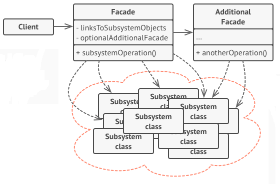
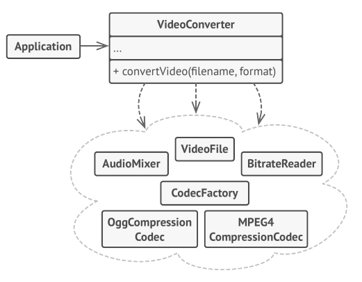

# The Pattern

The facade pattern simplifies a complex set of classes, such as a library or a framework, 
focusing in decouple the complex interaction inside of such a set and provide a simple 
interface containing only those features that the client needs. 

In fact, it can simplify any number of sets of classes in a single simple interface, 
from a single complex object to any number of systems, whether or not they interacts with each other. 

>Instead of making your code work with dozens ~~of the framework~~ classes directly, you create a facade class which 
encapsulates that functionality and hides it from the rest of the code.
This structure also helps you to minimize the effort of upgrading to future versions ~~of the framework~~ or replacing 
it with another one. 
The only thing you’d need to change in your app would be the implementation of the facade’s methods.  
-- Dive into Design Patterns

Since this pattern simplifies any number of complex system and classes, 
it is common to use an additional facade to simplify part of the set, as illustrated by the image below.   


# The Example

In this example, I used the pseudo code example from de 
[*Dive into Design Patterns*](https://refactoring.guru/design-patterns/book): a complex video conversion framework, 
shown int the figure below.  



# Run the example

This project was build using [Maven](http://maven.apache.org/), and to run it you need to get Maven via apt-get install 
or downloading it and then [install it](http://maven.apache.org/install.html).

Since this isn't a application, I wrote tests to validated the code.  
To run the tests, enter the maven project's folder ([mavenJava](./mavenJava)), and call:
```
mvn test
```